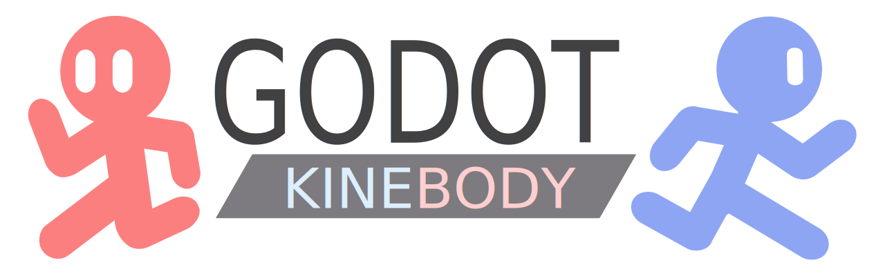

# Godot Addon - KineBody

This is a Godot addon that provides `KineBody2D` and `KineBody3D` nodes, which may improve your development of platform games.

## Supported targets

### Programming languages

* GDScript (Using `KineBody2D` and `KineBody3D`)
* C# (Using `KineBody2DCs` and `KineBody3DCs`)

### Versions

* Godot: >= 4.3
* Redot: >= 4.3
* Wedot: Waiting for release
* Blazium: Waiting for release

### Platforms

* Windows
* Linux
* macOS
* Android
* iOS
* Web(For C#, please use .NET 9.0 or later)

## Preuse

### Installation

* Download the release you want from `releases` and extract the addon folder to your Godot project's `addons` folder and cover the latter.
* (For C# versions) After installing the addon, create a C# solution from `Project -> Tools -> C# -> Create C# Solution`.

Since this addon is one that barely provides extra nodes, there is no `plugin.cfg` file, which means that you don't need to enable it in the project settings. It is enabled once you add it to your project.

### Language

It is recommended to use GDScript version, as it is more efficient and easier to use, and is coherent with Godot's low-level implementation. If you find performance bottlenecks, or you are more comfortable with C#, you can use the C# version.  

Due to some technical limitations, you cannot inherit a C# class from a GDScript class, vice versa. Therefore, make sure which kind of version you want to use before you start coding. Once you have selected one, keep on it as possible as you can.

## What is `KineBody*D`?

A `KineBody*D` is an derived object from `CharacterBody*D`, which is derived with extra features that help your development of platform games, especially for platform-game characters and enemies.

## Features of `KineBody*D`

### Gravity

Gravity is a common and important technique in most platform games. However, with `CharacterBody*D`, you cannot yet deploy the gravity system in fingers. Now, `KineBody*D` helps you solve this problem: By introducing `gravity_scale` property, just like one in `RigidBody*D`, it is allowed to realize the gravity system in one minute.  

Many platform games have their players falling with maximum falling speed, and in `KineBody*D`, you can set the maximum falling speed (`max_falling_speed`) with literally a fingertip.  

To activate these features, you should call `move_kinebody()` to make it move with this technique. In this wrapper method of `move_and_slide()`, the gravity is applied automatically to the current `KineBody*D` instance.

### Rotation snapping

For some multi-gravity games, players needs to rotate to fit its apperance to how they should be like in a multi-gravity space. For example, a character in a gravity space whose direction is up should be upside down.  

`KineBody` help you with this problem by introducing a system called `rotation snap`, meaning that when the character is in a special gravity space, its rotation will be snapped to a certain with a tween effect. A new property,`rotation_synchronizing_duration`, is introduced to control the duration of the tween effect. If you need it faster just tweak this value lower.  

The rotation is snapped to the `up_direction` rotating by 90° to make sure the rotation (`global_rotation`) of body fit with its rendering and appearence. To make this work, you need to call `move_kinebody()` as well when the body is going to move, or `synchronize_global_rotation_to_up_direction()` if you want to snap the rotation immediately or manually.

### Motion vector

Sometimes, we may think of making a character that is able to move in a space with uncommon gravity direction, especially when you are going to make such a game with the feature of varying gravity space and on-sphere walking. In this case, however, you have to consider what the velocity should be, and hence you have to implement transformation to the velocity. This is a literally pain and boring process, and would be more annoying because of inacquiantance with the transformation to the velocity. To solve this problem, `motion_vector` is introduced, which is also called **local velocity** because it is transformed from the velocity to a certain variant by a specific transformation. By default, `motion_vector` will transform teh velocity to a value perpendicular to the `up_direction` of the body, and you can set the `motion_vector_direction` to make the transformation by other means. That is to say, if you only know how to set the velocity in a normal gravity space, but you want to set one in an upside-down gravity space, just set `motion_vector` to the value in the normal space and it will be automatically transformed to the velocity in the upside-down space.

### Collision signals

In original `CharacterBody*D`, there is no collision signal. `KineBody*D` provides collision signals that you can use to detect collisions between `KineBody*D` instances and other physics bodies. There are three signals available:

* `collided_wall()`
* `collided_ceiling()`
* `collided_floor()`

They are emitted respectively when the corresponding collision event is invoked.

### General physics methods

#### WIP

## Known issues

Currently, there are no known issues with `KineBody*D`. Meanwhile, the addon is tested only on GodotPhysics2D/3D, which means that it is not guaranteed to work with other physics engines like Jolt3D, Box2D, Rapier, etc. If you find any issues during the use of the addon, please give your feedback in [Issues](https://github.com/Lazy-Rabbit-2001/godot-addon-kinebody/issues).

## Used fonts in logo

* Cyberion Demo
* Dunkin Sans

## Credits

* 悠鱼/咸鱼/幻灭者001·Yukana(@Lazy-Rabbit-2001): Main programmer and designer, logo designer.
* Ghostyii: Tutorial author of how to make a sphere-walking character, link [here](https://ghostyii.com/ringworld/).
* militaryg: Sharing solution of 3D rotation snapping, link [here](https://forum.godotengine.org/t/3d-moving-around-sphere/63674/4).
* Letterhend Studio: Designer of the font Cyberion Demo.
* Neale Davidson: Designer of the font Dunkin Sans.
